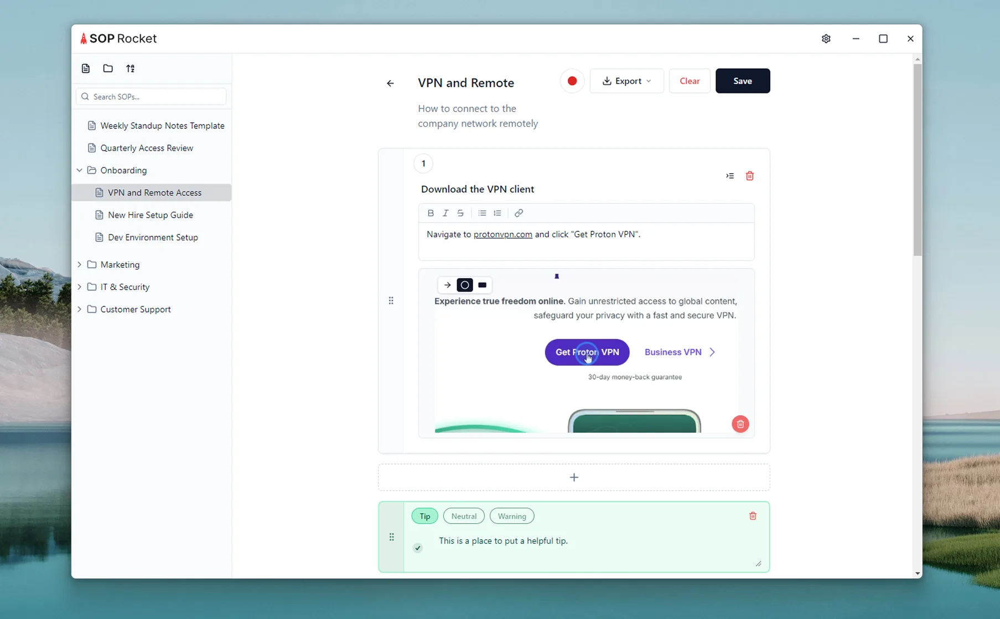
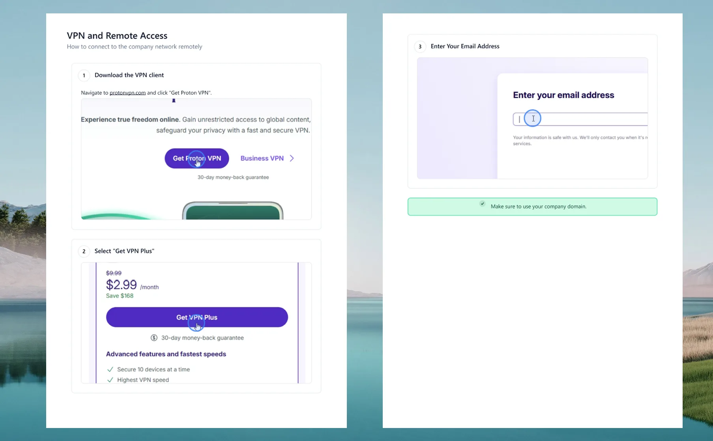

<h1 align="center">
  <br />
  SOP Rocket
</h1>

<p align="center">
  A free, open-source desktop app for creating Standard Operating Procedures.<br />
  Capture screenshots, annotate them, and export polished PDFs — in minutes.
</p>

<p align="center">
  <a href="https://github.com/dylanpjenkins/sop-rocket/releases"><strong>Download for Windows</strong></a>
  &nbsp;&middot;&nbsp;
  <a href="#build-from-source">Build from Source</a>
  &nbsp;&middot;&nbsp;
  <a href="#contributing">Contributing</a>
</p>

---

## Screenshots

| Editor | PDF Output |
|--------|------------|
|  |  |

---

## Features

- **Organized library** — Store SOPs in folders with drag-and-drop reordering, search, and a configurable storage path.
- **Step-by-step editor** — Add steps with screenshots (drag-and-drop, paste, or auto-capture via screen recording), then reorder with drag handles.
- **Annotations** — Draw circles, arrows, ellipses, and blur regions directly on screenshots.
- **Tip callouts** — Insert color-coded tips, warnings, and notes between steps.
- **Rich text** — Format step descriptions with the built-in rich text editor.
- **Multi-format export** — Export to PDF, DOCX, Markdown, or HTML with optional brand colors and logos.
- **Theming** — Light, Dark, or system-matched theme with customizable brand accent colors.

## Download

Pre-built Windows installers are available on the [Releases](https://github.com/dylanpjenkins/sop-rocket/releases) page.

> **Note:** The installer is not code-signed, so Windows SmartScreen may show a warning. Click **"More info"** then **"Run anyway"** to proceed.

## Build from Source

```bash
git clone https://github.com/dylanpjenkins/sop-rocket.git
cd sop-rocket
npm install
```

### Development

```bash
npm run dev
```

### Production Build (Windows)

```bash
npm run build:win
```

Output: `release/` directory (NSIS installer).

## Keyboard Shortcuts

| Shortcut | Action |
|---|---|
| Ctrl+S | Save |
| Ctrl+Shift+E | Export PDF |
| Escape | Back to Library |

## Contributing

Contributions are welcome! Feel free to open an issue or submit a pull request.

## License

[MIT](LICENSE)

## Support

If you find this project useful, consider [sponsoring on GitHub](https://github.com/sponsors/dylanpjenkins).
